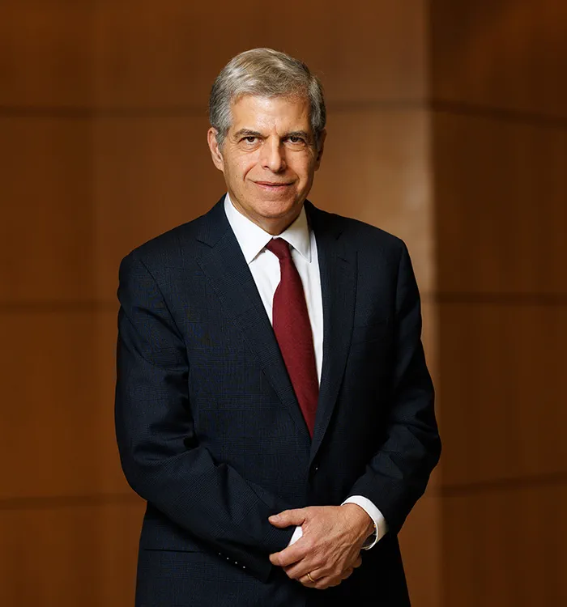

# Opening Remarks

## J. Michael Oakes

{.center width="300px"}

**Senior Vice President for Research, Office of Research and Technology Management**

**Veale Professor of Technology Transfer and Commercialization**

**Professor, Department of Population and Quantitative Health Sciences, School of Medicine**

Dr. Michael Oakes, Case Western Reserve University's inaugural Senior Vice President for Research and Technology Management, is a distinguished leader overseeing a robust \$550M+ research and technology transfer program, including the university's forthcoming \$300M Interdisciplinary Science and Engineering Building and technology start-up incubator. As the Veale Professor of Technology Transfer and Commercialization Chair and a tenured Professor of Population and Quantitative Health Sciences, Dr. Oakes has a proven track record in catalyzing research growth and innovation---having previously served as interim VP for Research at the University of Minnesota and achieved a 31% increase in research funding through COVID-19 initiatives. A renowned applied statistician and social epidemiologist, he has published over 150 scientific papers, co-authored a leading textbook, and founded the Robert Wood Johnson Foundation's Interdisciplinary Research Leaders program, all while advancing collaborative, interdisciplinary research in methods, social epidemiology, and research ethics.

## Gary Schwartz

{.center width="300px"}

**Director, Case Comprehensive Cancer Center**

**Vice Dean for Oncology, School of Medicine**

**Gertrude Donnelly Hess MD Professor in Oncology Research**

Dr. Gary Schwartz is the Director of the Case Comprehensive Cancer Center (Case CCC). Formerly Chief of Hematology and Oncology at Columbia University Irving Medical Center (CUIMC) and Deputy Director of the Herbert Irving Comprehensive Cancer Center, his vision is to establish highly innovative, transformative clinical translational research programs in the field of cancer therapy.

# Poster Award Presentation and Remarks

## Jonathan Haines

{.center width="300px"}

**Chair, Department of Population and Quantitative Health Sciences, School of Medicine**

**Mary W. Sheldon MD Professor of Genomic Sciences, Department of Population and Quantitative Health Sciences, School of Medicine**

**Professor, Department of Genetics and Genome Sciences, School of Medicine**

**Professor, Department of Ophthalmology and Visual Sciences, School of Medicine**

**Founder and Director, Cleveland Institute for Computational Biology, School of Medicine**

Dr. Jonathan Haines is an internationally recognized researcher and educator with extensive experience in all aspects of genetic epidemiology, with a particular focus on illuminating the genetic architecture of complex diseases. He has applied his expertise to numerous brain and eye disorders and is credited with locating more than 20 causal and 300 associated genetic loci. He has led or collaborated on dozens of national and international genetic studies, lending his expertise to understanding the impact of genetic variation on common diseases such as age-related macular degeneration, glaucoma, and Alzheimer's disease.

# Keynote and Closing Remarks

## Stan Gerson

{.center width="300px"}

**Dean, School of Medicine**

**Senior Vice President for Medical Affairs**

**Director, National Center for Regenerative Medicine**

**Professor, Department of Medicine**

**Professor, Department of Environmental Health Sciences**

**Member, Immune Oncology Program, Case Comprehensive Cancer Center**

Dr. Stan Gerson is the Dean and Senior Vice President for Medical Affairs at Case Western Reserve University School of Medicine, where he is the Asa and Patricia Shiverick--Jane Shiverick (Tripp) Professor of Hematological Oncology and Case Western Reserve University Distinguished University Professor. In 2012, he was the recipient of the Case Western Reserve Medal for Excellence in Health Science Innovation, the highest honor bestowed by the School of Medicine to those advancing research, education and health care. He is the past president of the Association of American Cancer Institutes (2016-2018) and a member of the American Association of Physicians since 1997, and has been a member and Chair of numerous NIH study sections, including the National Cancer Institute (NCI) Board of Scientific Advisors. He serves on the Executive Advisory Board of 11 NCI-designated cancer centers. He has earned multiple National Institutes of Health (NIH) grants and published more than 258 journal articles, 275 abstracts, 37 book chapters and 18 patents. Dr. Gerson has distinguished himself in a number of realms, including his research in DNA repair and stem cell therapy, which has resulted in numerous publications and patents. Three of his discoveries are in clinical trials as new cancer therapies. He is also the co-editor of the internationally recognized textbook, "Gene Therapy of Cancer Translational Approaches from Preclinical Studies to Clinical Implementation 3" (Elsevier Limited, Oxford, United Kingdom) and the textbook "Clinical Hematology." Dr. Gerson is foremost, a mentor and educator for the next generation of compassionate cancer research scientists and clinicians.
